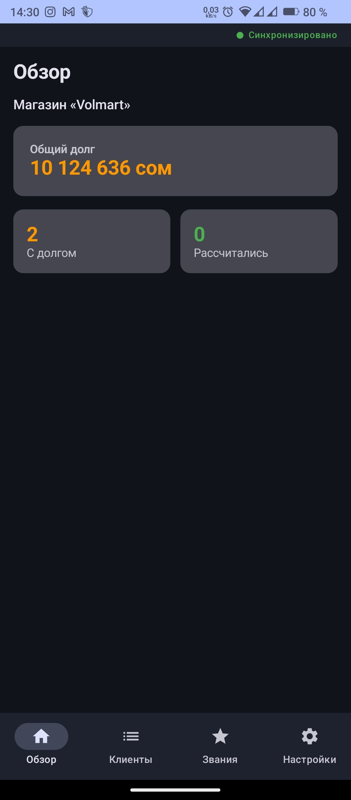
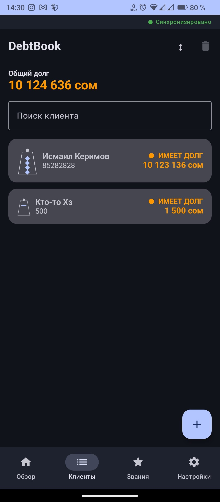
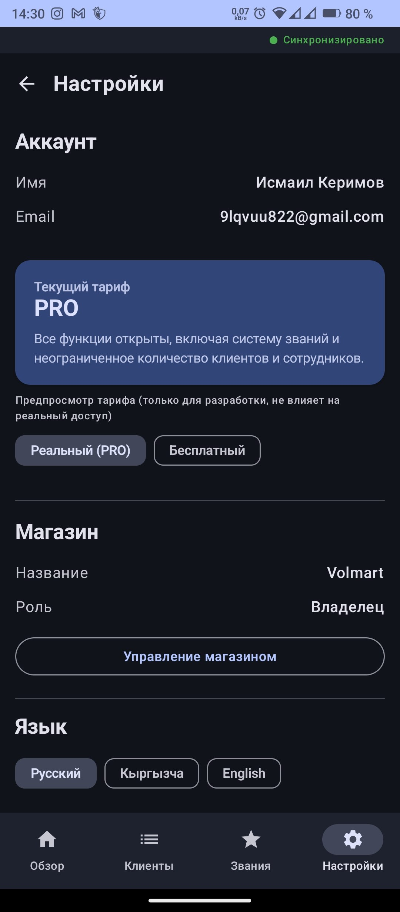
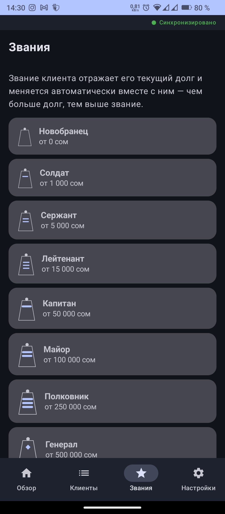
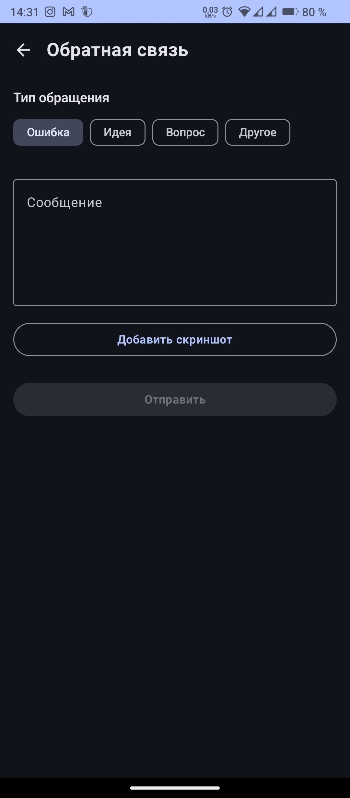

# DebtBook

**DebtBook** — Android-приложение для небольших магазинов и малого бизнеса, которое помогает вести учёт долгов клиентов, платежей и работы магазина в одном месте.

DebtBook создан как современная замена бумажным тетрадям и разрозненным заметкам, которые часто используются для учёта долгов постоянных клиентов.

---

## 🏠 Обзор

Главный экран показывает основную финансовую информацию магазина: общую сумму задолженности, количество клиентов с долгом и количество клиентов, которые полностью рассчитались.

DebtBook позволяет быстро оценить состояние магазина без необходимости вручную просматривать каждого клиента.

---

## 👥 Клиенты и задолженности

Основная часть приложения — управление клиентами и их долгами.

Можно:

- добавлять клиентов;
- просматривать текущую задолженность;
- регистрировать платежи;
- просматривать историю операций;
- автоматически рассчитывать текущий баланс;
- быстро находить нужного клиента через поиск.

Каждый клиент отображается вместе с его текущим финансовым состоянием, поэтому размер задолженности можно увидеть непосредственно из списка.

---

## 🏪 Магазин и сотрудники

DebtBook поддерживает работу магазина с несколькими пользователями.

Доступны роли:

- **OWNER** — владелец магазина;
- **EMPLOYEE** — сотрудник.

Данные магазина изолированы от данных других магазинов, а права доступа контролируются серверной частью.

Настройки магазина доступны непосредственно из приложения.

В настройках также отображаются данные аккаунта, текущая подписка и информация о магазине.

---

## ⭐ Подписка PRO

DebtBook поддерживает бесплатный план и расширенную **PRO-подписку**.

### 🆓 Бесплатный план

Бесплатная версия позволяет использовать основной функционал приложения, но имеет ограничения:

- до **100 должников**;
- до **1 сотрудника**;
- без доступа к системе званий;
- ограниченный набор дополнительных возможностей.

### ⭐ PRO

PRO снимает основные ограничения бесплатного плана и открывает расширенные возможности приложения.

В PRO доступны:

- неограниченное количество клиентов;
- расширенная работа с сотрудниками;
- система званий должников;
- дополнительные функции управления магазином.

---

## 🎖️ Система званий

DebtBook включает отдельную систему званий, связанную с текущей задолженностью клиента.

Чем больше долг клиента, тем выше его звание.

Система содержит последовательность званий, начиная от **Новобранца** и заканчивая высокими званиями при значительной задолженности.

Звание изменяется автоматически вместе с изменением долга и является дополнительным визуальным элементом приложения.

---

## 🔐 Аккаунт и безопасность

Для работы с DebtBook предусмотрена система авторизации.

Поддерживаются:

- вход через Google;
- регистрация и вход через Email;
- подтверждение Email;
- восстановление пользовательской сессии;
- серверная аутентификация через Supabase.

Для защиты данных используется:

- **Supabase Auth**;
- **PostgreSQL**;
- **Row Level Security (RLS)**;
- серверная проверка прав доступа;
- изоляция данных разных магазинов.

---

## 🔄 Offline-first

DebtBook построен с учётом принципа **offline-first**.

Основные данные хранятся локально, поэтому приложение не должно зависеть от постоянного подключения к интернету для выполнения основных операций.

Изменения синхронизируются с серверной инфраструктурой, когда соединение доступно.

В интерфейсе отображается текущее состояние синхронизации.

---

## 💬 Обратная связь

В приложении есть встроенная система обратной связи.

Пользователь может выбрать тип обращения:

- ошибка;
- идея;
- вопрос;
- другое.

Можно описать проблему или предложение и при необходимости приложить скриншот.

Это позволяет собирать обратную связь непосредственно от пользователей приложения и использовать её для дальнейшего развития DebtBook.

---

## ⚙️ Управление системой

Для внутреннего управления сервисом предусмотрены специальные административные инструменты.

Они позволяют централизованно управлять пользователями, доступом и сервисными функциями.

Внутренняя система управления не является частью основного пользовательского интерфейса приложения.

---

## 🛠️ Технологии

- **Kotlin**
- **Jetpack Compose**
- **Android**
- **Room**
- **Supabase**
- **PostgreSQL**
- **Row Level Security (RLS)**
- **Kotlin Coroutines / Flow**

Архитектура проекта разделена на UI, Domain и Data слои.

---

## 📱 Интерфейс

DebtBook использует современный интерфейс на базе Jetpack Compose.

Основные разделы приложения:

- **Обзор** — финансовая статистика магазина;
- **Клиенты** — управление должниками;
- **Звания** — система рангов;
- **Настройки** — аккаунт, подписка и магазин.

Навигация между основными разделами доступна непосредственно из нижней панели приложения.

---

## 🚀 Текущий статус

**Beta / Pre-1.0**

Основное функциональное ядро DebtBook уже реализовано.

В текущей версии доступны:

- учёт клиентов и долгов;
- платежи и история операций;
- магазины;
- система сотрудников и ролей;
- Google и Email авторизация;
- серверная инфраструктура;
- бесплатный и PRO-планы;
- система званий;
- обратная связь;
- административное управление сервисом;
- offline-first архитектура.

Проект продолжает развиваться и проходит тестирование перед переходом к стабильному релизу.

---

## 🔮 Дальнейшее развитие

В дальнейшем DebtBook будет расширяться новыми инструментами для владельцев магазинов, включая:

- более глубокую аналитику;
- экспорт данных;
- улучшенную работу с несколькими устройствами;
- дополнительные инструменты управления магазином;
- дальнейшее усиление безопасности и надёжности синхронизации.

---

## 🎯 Цель проекта

Цель DebtBook — сделать учёт долгов для небольших магазинов простым, быстрым и надёжным.

Приложение постепенно развивается от простой электронной тетради должников в полноценный инструмент управления клиентами, сотрудниками и финансовыми операциями магазина.

---

**Platform:** Android  
**Stage:** Beta / Pre-1.0
